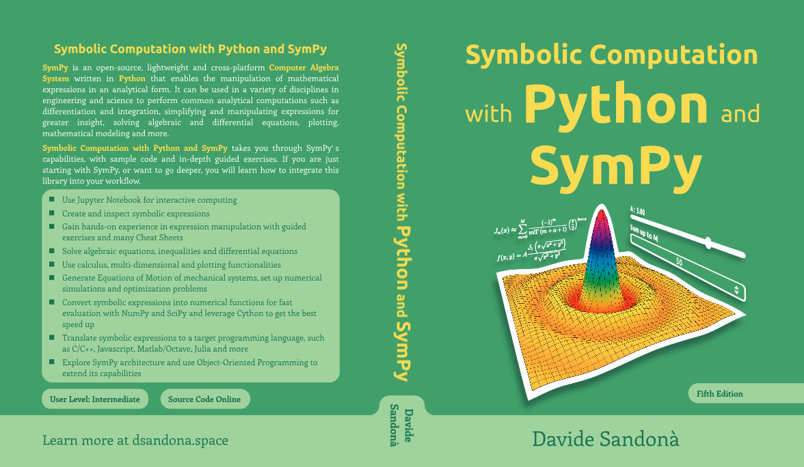

# Symbolic Computation with SymPy

This repository contains the necessary Jupyter Notebooks and code to follow the book **"Symbolic Computation with Python and [SymPy](https://github.com/sympy/sympy/)"**, which can be purchased at **Amazon**: it is available in all amazon markets (COM, DE, IT, UK, ...).
  * [Printed Version](https://www.amazon.com/dp/B09HJ1WZ7K)
  * Ebook: for publishing reasons, the printed book had to be splitted in two volumes. Vol 1 + Vol 2 = Printed Book.
    * [Volume 1 - Expression Manipulation](https://www.amazon.com/dp/B09HV4RQFS)
    * [Volume 2 - Linear Algebra, Plotting and Code Generation](https://www.amazon.com/dp/B09HV9QQCL)

Please, read the [preview](assets/preview-third-edition.pdf) to understand what this book offers and who should read it.

## Editions

This repository contains the material associated with the **third edition** of the book. The notebooks associated to the first or second edition can be downloaded from the **Releases** page, which can be found on the right hand side of the screen.

## Notebooks 

The repository contains a list of notebooks, each one named after a chapter. Notebooks only contain the code: they are meant to be followed by Readers. The explanations for the code can be found in the book.

Some chapters offers an *Advanced Topics* section, which is meant to be optional but highly recommended.

**The chapters containing exercises are not included in this repository**: this is done intentionally to force the Readers to actively follow the book, code their attempts and understand the different steps, hence gaining experience with SymPy.

You can try the notebooks without downloading or installing the software by clicking the following button:

## Code

The following code files are included in the repository, which are going to be used by some notebooks:

* `sympy_utils.py`: it contains functions and classes that can be useful to any SymPy user. Take a look at the `README.md` file contained in the `sympy_utils_module` folder to see a list of available functions/classes.

## Module

The function and classes contained in `sympy_utils.py` can also be useful in our every-day problems. Hence, a package has been created (the `sympy_utils_module` folder), which can be easily installed on our systems:

* Open a terminal and move into the `sympy_utils_module` folder.
* `pip3 install .`